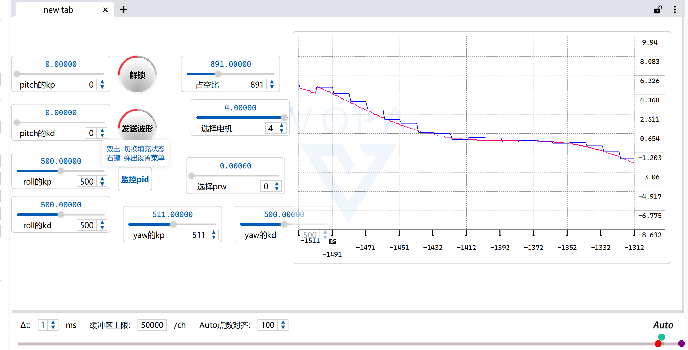

# STM32-RT-thread 四旋翼无人机
作者 Cagt (From Guangdong Ocean University)

## 目录
* [项目简介](#项目简介)
* [业务代码文件结构](#业务代码文件结构)
* [代码框架示意图](#代码框架示意图)
* [代码功能添加](#代码编写)

---
## 项目简介
 该项目是在 STM32 平台上运行 rt-thread 的一个四旋翼无人机系统，采用模块化的设计方法设计。将整个无人机系统细分为姿态解算、debug 调试、姿态控制、远程遥控四个模块(目前只实现了前三个，远程遥控还没写捏 0.0 )，每一个模块之间的通信采用间接引用的方式。代码风格与 Linux 内核代码风格类似，与 Robomaster 官方步兵代码风格雷同。
 配套硬件:

 ## 业务代码文件结构
    \---application
        \---inc
        |       ahrs_task.h
        |       arm_math.h
        |       blue_tooth_debug_task.h
        |       control_task.h
        |       filter_lib.h
        |       includes.h
        |       pid_algorithm.h
        |       remote_ctr_task.h
        |       
        \---src
            |   main.c
            |   pid_algorithm.c
            |   
            \---thread_task
                    ahrs_task.c
                    blue_tooth_debug_task.c
                    control_task.c
                    filter_lib.c
                    remote_ctr_task.c

 * ahrs_task.c/h ：是姿态解算模块的实现。
 * blue_tooth_debug_task.c/h ：是无人机模块的蓝牙调试和遥控模块
 * control_task.c/h：是无人机控制姿态模块的实现
 * fliter_lib.c/h：是无人机滤波算法库
 * remote_ctr_task.c/h：是无人机远程遥控模块
 * pid_algorithm.c/h：是无人机PID控制算法的实现
> 注: 每个模块之间通信是通过 get_xxx_handler_point() 函数返回模块的句柄实现

 ## 代码框架示意图
 该示意图详细介绍了模块之间的联系和模块的详细功能

  

 

 ## 代码编写
* 如果你想添加控制模式
    1. 在 FLYING_MODE 中添加飞行模式
    2. 在 control_task.c 中编写自己的控制函数
    3. 在 swtich_mode 中按照同样的代码方式将自己的控制函数添加进去

* 如果你想使用不同的陀螺仪

    得益于 rt-thread 的完善的驱动框架,你可能只需要更改陀螺仪的初始化函数和读取函数

    1. 修改 ahrs_init 中的 ahrs_handler->mpu 指针,使其新指向 rt-thread 的xxx_init 陀螺仪初始化函数

    2. mpu_calc_task 函数中的读取原始 accel 和 gyro 的函数需要改成 rt-thread 实现的陀螺仪驱动

    > 默认使用的是卡尔曼滤波融合姿态, z轴加速度为二阶低通滤波 x、y轴加速度使用一阶低通滤波，实测效果最好。如果有更高级的算法,也可以加入filter_lib.c/h中(记得按照模板~)

* 如果你想完善+修改调试方式
    1. 本项目目录有 vofa+ json 模板,添加自己想要的模组 
    2. 在  blue_tooth_debug_task.h 的 sendPackage_t 结构体中添加用于保存自己模块值得变量
    3. 在  blue_tooth_debug_task.c 的 setv 的 name_list[] 中根据模板添加自己想要设置发送的控制量名称(最好别超过4个字符)，并在 switch 中加入自己模块值的处理方式。例如 name_list 中的第一个元素是 "kp"，那么在下面的switch case 0 中将 value 值 保存到 package.kp 中。
    
    